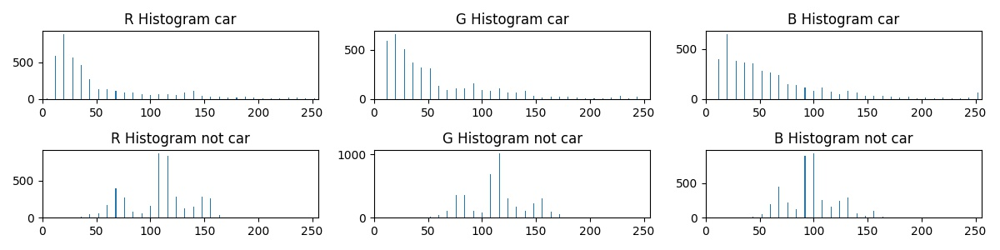
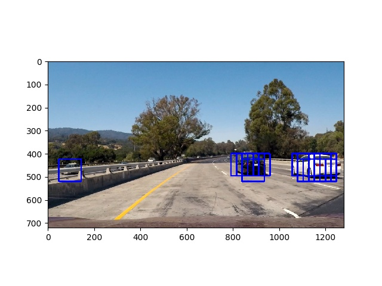
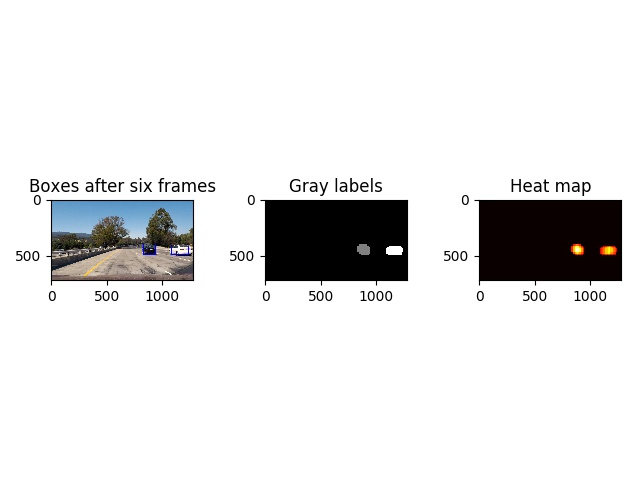

# Vehicle Detection
[](http://www.udacity.com/drive)

---

The goals / steps of this project are the following:

* Perform a Histogram of Oriented Gradients (HOG) feature extraction on a labeled training set of images and train a classifier Linear SVM classifier
* Optionally, you can also apply a color transform and append binned color features, as well as histograms of color, to your HOG feature vector. 
* Note: for those first two steps don't forget to normalize your features and randomize a selection for training and testing.
* Implement a sliding-window technique and use your trained classifier to search for vehicles in images.
* Run your pipeline on a video stream (start with the test_video.mp4 and later implement on full project_video.mp4) and create a heat map of recurring detections frame by frame to reject outliers and follow detected vehicles.
* Estimate a bounding box for vehicles detected.

### Lets start to analyse present data

Data sets to train classifier:

Data [vehicle](https://s3.amazonaws.com/udacity-sdc/Vehicle_Tracking/vehicles.zip) and [non-vehicle](https://s3.amazonaws.com/udacity-sdc/Vehicle_Tracking/non-vehicles.zip) 

These example images come from a combination of the [GTI vehicle image database](http://www.gti.ssr.upm.es/data/Vehicle_database.html), the [KITTI vision benchmark suite](http://www.cvlibs.net/datasets/kitti/), and examples extracted from the project video itself.   

Some data from udacity: [Udacity labeled dataset](https://github.com/udacity/self-driving-car/tree/master/annotations).

### Histogram of Oriented Gradients (HOG)

#### Reading in training images

A list of traning images is collected in module "train.py" (L:48-49) calling features.py module function "features_from_img_list". 

Example of training set images:


The module features.py (L:114-135) is reading the "png" files, tranforming to choosen color space "YCrCb" and extracting features.

Those features are histogram, spatial binning and hog (skimage.hog) of each color channel.




Example for HOG using `orientations=9`, `pixels_per_cell=(8, 8)` and `cells_per_block=(2, 2)`
See details: http://scikit-image.org/docs/dev/api/skimage.feature.html?highlight=feature%20hog#skimage.feature.hog

YCrCb:


Other channels who might also have worked under several conditions. Maybe even combining different color spaces for the hog features. But not tested.

YUV:


LUV:


HLS:


#### Final choice of HOG parameters

The parameters `orientations=9`, `pixels_per_cell=(8, 8)` and `cells_per_block=(2, 2)` looked promising based on result of training and looking at the features for
different color channels.

#### Training a classifier

This is implemented in module train.py (L:13-45) with a pipeline (using normalization StandardScaler and LinearSVC). Only the vehicle and non-vehicle data sets have 
been used not considering the time series of same images leading to overfitting.

Example training result:

```
Train Accuracy of SVC =  1.0
Test Accuracy of SVC =  0.992054893463
```

### Sliding window search

#### Scalind and overlapping

Actually used the hog sub-sampling introduced in udacity class in module pipeline.py (L:47-140). Which creates a hog features of lower image part and steps with defined 
overlapping window. I have tried different scales and overlaps which led to different false positiv and multiple detection which are later handled and filtered by the heatmap approach.

Basically the choice at the end was using two different scaling factors and just kept stepping by two cells with overlap of 75%, which deliverd sufficient result covering the car.

#### Examples of pipeline test images and optimizing performance of classifier

As mentioned before performance was improved by not applying hog extraction on each window instead for the whole lower part. Hog features were created of all three
channels of the color conversion and combined with spatial binning and color histogram features as input for the pipeline setup of the classifier (see train.py).
Each hit was recorded as found box. This can be seen in following examples. This results is influenced by different scaling and overlapping cell steps. 
Furthermore only each 10th frame was evaluated in the video processing.

Example result:




### Video

#### Project video with identified vehicles as far as possible

Link [project video](./result_project_video.mp4)

####  Filter of false positives and multiple detection due to overlapping

The successfully classified windows boxes (from both scale searches) were sampled to a heatmap which was further tresholded to remove false positives since car 
has more detected windows. In next step heatmap is labeled with `scipy.ndimage.measurements.label()`.
Based on this labels bounding boxes have been constructed see image below.



---

### Discussion

Finding right balance on scale and search area to catch cars in different location on the image and different distance leads to more false positives. 
The classification itself needs good generalized features of a car in different sizes and conditions. To make it more robust more data can be used for example the udacity data.
Maybe combining different color spaces or even use further sensors to detect cars would be further supportive for sanity check of possible cars. Furthermore when the cars could 
communicate with each other they might get more information of the world around them. 
The performance itself can be improved by parallelizing the window analysis even in real time.

Open points: not yet clear why undistortion screws up the detection.